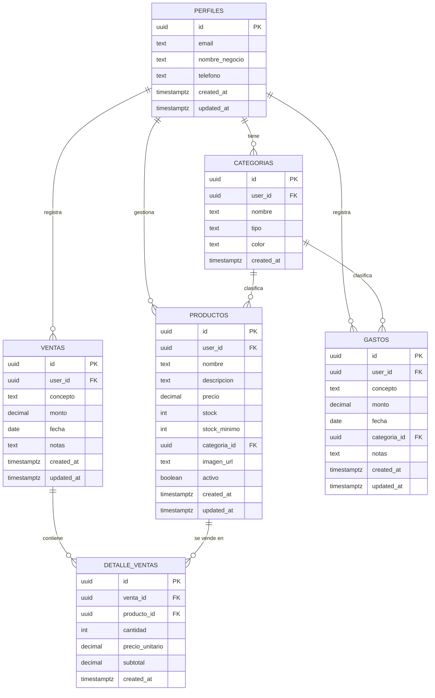

# 📦 Base de Datos - MarketMove

Esta documentación describe el esquema completo de la base de datos para la aplicación MarketMove implementado en Supabase.

## 📋 Tabla de Contenidos

- [Resumen](#resumen)
- [Diagrama de Entidad-Relación](#diagrama-de-entidad-relación)
- [Tablas](#tablas)
- [Seguridad (RLS)](#seguridad-rls)
- [Configuración](#configuración)
- [Ejemplos de Uso](#ejemplos-de-uso)

## Resumen

El esquema de base de datos está diseñado para soportar:
- ✅ Gestión de usuarios y perfiles
- 📦 Inventario de productos
- 💰 Registro de ventas
- 💸 Control de gastos
- 🏷️ Categorización de productos y gastos
- 🔒 Seguridad a nivel de filas (RLS)

## Diagrama de Entidad-Relación



## Tablas

### 1. `perfiles`

Extiende la información de los usuarios de autenticación de Supabase.

| Campo | Tipo | Descripción |
|-------|------|-------------|
| `id` | UUID | PK, vinculado a `auth.users` |
| `email` | TEXT | Email del usuario |
| `nombre_negocio` | TEXT | Nombre del negocio (opcional) |
| `telefono` | TEXT | Teléfono de contacto (opcional) |
| `created_at` | TIMESTAMPTZ | Fecha de creación |
| `updated_at` | TIMESTAMPTZ | Última actualización |

**Características:**
- Se crea automáticamente vía trigger cuando un usuario se registra
- Campos `created_at` y `updated_at` gestionados automáticamente

---

### 2. `categorias`

Permite clasificar productos y gastos.

| Campo | Tipo | Descripción |
|-------|------|-------------|
| `id` | UUID | PK, generado automáticamente |
| `user_id` | UUID | FK a `perfiles` |
| `nombre` | TEXT | Nombre de la categoría |
| `tipo` | TEXT | Tipo: 'producto' o 'gasto' |
| `color` | TEXT | Color en formato hex (ej: '#6366f1') |
| `created_at` | TIMESTAMPTZ | Fecha de creación |

**Restricciones:**
- `tipo` solo acepta valores: 'producto' o 'gasto'
- Combinación única: `user_id` + `nombre` + `tipo`

---

### 3. `productos`

Gestión del inventario de productos.

| Campo | Tipo | Descripción |
|-------|------|-------------|
| `id` | UUID | PK, generado automáticamente |
| `user_id` | UUID | FK a `perfiles` |
| `nombre` | TEXT | Nombre del producto |
| `descripcion` | TEXT | Descripción (opcional) |
| `precio` | DECIMAL(10,2) | Precio unitario (>= 0) |
| `stock` | INTEGER | Cantidad en inventario (>= 0) |
| `stock_minimo` | INTEGER | Alerta de stock bajo (default: 10) |
| `categoria_id` | UUID | FK a `categorias` (opcional) |
| `imagen_url` | TEXT | URL de imagen (opcional) |
| `activo` | BOOLEAN | Si el producto está activo (default: true) |
| `created_at` | TIMESTAMPTZ | Fecha de creación |
| `updated_at` | TIMESTAMPTZ | Última actualización |

**Características:**
- Vista `vista_productos_bajo_stock` muestra productos con stock <= stock_minimo

---

### 4. `ventas`

Registro de todas las ventas realizadas.

| Campo | Tipo | Descripción |
|-------|------|-------------|
| `id` | UUID | PK, generado automáticamente |
| `user_id` | UUID | FK a `perfiles` |
| `concepto` | TEXT | Descripción de la venta |
| `monto` | DECIMAL(10,2) | Monto total (>= 0) |
| `fecha` | DATE | Fecha de la venta |
| `notas` | TEXT | Notas adicionales (opcional) |
| `created_at` | TIMESTAMPTZ | Fecha de creación |
| `updated_at` | TIMESTAMPTZ | Última actualización |

---

### 5. `detalle_ventas`

Detalle de productos vendidos en cada venta.

| Campo | Tipo | Descripción |
|-------|------|-------------|
| `id` | UUID | PK, generado automáticamente |
| `venta_id` | UUID | FK a `ventas` |
| `producto_id` | UUID | FK a `productos` (opcional) |
| `cantidad` | INTEGER | Cantidad vendida (> 0) |
| `precio_unitario` | DECIMAL(10,2) | Precio al momento de venta (>= 0) |
| `subtotal` | DECIMAL(10,2) | Calculado: cantidad × precio_unitario |
| `created_at` | TIMESTAMPTZ | Fecha de creación |

**Características:**
- Campo `subtotal` es calculado automáticamente (columna generada)

---

### 6. `gastos`

Registro de todos los gastos del negocio.

| Campo | Tipo | Descripción |
|-------|------|-------------|
| `id` | UUID | PK, generado automáticamente |
| `user_id` | UUID | FK a `perfiles` |
| `concepto` | TEXT | Descripción del gasto |
| `monto` | DECIMAL(10,2) | Monto del gasto (>= 0) |
| `fecha` | DATE | Fecha del gasto |
| `categoria_id` | UUID | FK a `categorias` (opcional) |
| `notas` | TEXT | Notas adicionales (opcional) |
| `created_at` | TIMESTAMPTZ | Fecha de creación |
| `updated_at` | TIMESTAMPTZ | Última actualización |

---

## Seguridad (RLS)

Todas las tablas tienen **Row Level Security (RLS)** habilitado. Esto garantiza que:

- ✅ Los usuarios solo pueden ver, crear, actualizar y eliminar **sus propios datos**
- ✅ No es posible acceder a datos de otros usuarios
- ✅ Las políticas se aplican automáticamente en todas las consultas

### Políticas implementadas

Para cada tabla principal (`perfiles`, `categorias`, `productos`, `ventas`, `gastos`):

1. **SELECT**: Solo registros donde `user_id = auth.uid()`
2. **INSERT**: Solo si `user_id = auth.uid()`
3. **UPDATE**: Solo registros donde `user_id = auth.uid()`
4. **DELETE**: Solo registros donde `user_id = auth.uid()`

Para `detalle_ventas`, las políticas verifican que la venta asociada pertenezca al usuario autenticado.

---

## Vistas Útiles

### `vista_balance`

Calcula el balance general del usuario (ventas - gastos).

```sql
SELECT * FROM vista_balance WHERE user_id = auth.uid();
```

Columnas:
- `user_id`: ID del usuario
- `total_ventas`: Suma de todas las ventas
- `total_gastos`: Suma de todos los gastos
- `balance`: Diferencia entre ventas y gastos

### `vista_productos_bajo_stock`

Lista productos con stock menor o igual al stock mínimo.

```sql
SELECT * FROM vista_productos_bajo_stock WHERE user_id = auth.uid();
```

---

## Configuración

### Paso 1: Crear proyecto en Supabase

1. Ve a [https://supabase.com](https://supabase.com)
2. Crea un nuevo proyecto
3. Espera a que se inicialice

### Paso 2: Ejecutar el script SQL

1. En Supabase, ve a **SQL Editor**
2. Abre el archivo [`supabase_schema.sql`](file:///C:/Users/iscov/ProyectoPresupuesto/marketmove_app/supabase_schema.sql)
3. Copia TODO el contenido
4. Pégalo en el editor SQL de Supabase
5. Haz clic en **Run**
6. Verifica que no haya errores

### Paso 3: Configurar credenciales en Flutter

1. Copia el archivo [`supabase_config_example.dart`](file:///C:/Users/iscov/ProyectoPresupuesto/marketmove_app/lib/src/shared/config/supabase_config_example.dart) como `supabase_config.dart`
2. En Supabase, ve a **Settings > API**
3. Copia el **Project URL** y el **anon public key**
4. Reemplaza los valores en `supabase_config.dart`
5. Agrega `supabase_config.dart` a tu `.gitignore`

---

## Ejemplos de Uso

### Inicializar Supabase en Flutter

```dart
import 'package:supabase_flutter/supabase_flutter.dart';
import 'src/shared/config/supabase_config.dart';

Future<void> main() async {
  WidgetsFlutterBinding.ensureInitialized();
  
  await Supabase.initialize(
    url: SupabaseConfig.supabaseUrl,
    anonKey: SupabaseConfig.supabaseAnonKey,
  );
  
  runApp(MyApp());
}
```

### Obtener productos

```dart
final supabase = Supabase.instance.client;

// Obtener todos los productos del usuario actual
final productos = await supabase
    .from('productos')
    .select()
    .order('nombre');

// Obtener productos activos
final productosActivos = await supabase
    .from('productos')
    .select()
    .eq('activo', true)
    .order('nombre');
```

### Insertar una venta

```dart
// Crear la venta
final ventaData = {
  'user_id': supabase.auth.currentUser!.id,
  'concepto': 'Venta de productos',
  'monto': 150.00,
  'fecha': DateTime.now().toIso8601String().split('T')[0],
  'notas': 'Venta en efectivo',
};

final venta = await supabase
    .from('ventas')
    .insert(ventaData)
    .select()
    .single();

// Agregar detalle de venta (opcional)
await supabase.from('detalle_ventas').insert({
  'venta_id': venta['id'],
  'producto_id': 'uuid-del-producto',
  'cantidad': 2,
  'precio_unitario': 75.00,
});
```

### Insertar un gasto

```dart
final gastoData = {
  'user_id': supabase.auth.currentUser!.id,
  'concepto': 'Alquiler del local',
  'monto': 800.00,
  'fecha': DateTime.now().toIso8601String().split('T')[0],
  'notas': 'Mes de diciembre',
};

await supabase.from('gastos').insert(gastoData);
```

### Obtener balance

```dart
final balance = await supabase
    .from('vista_balance')
    .select()
    .eq('user_id', supabase.auth.currentUser!.id)
    .single();

print('Total Ventas: ${balance['total_ventas']}');
print('Total Gastos: ${balance['total_gastos']}');
print('Balance: ${balance['balance']}');
```

### Verificar productos con stock bajo

```dart
final productosAlerta = await supabase
    .from('vista_productos_bajo_stock')
    .select()
    .eq('user_id', supabase.auth.currentUser!.id);

print('Productos con stock bajo: ${productosAlerta.length}');
```

---

## 🔧 Mantenimiento

### Triggers automáticos

El esquema incluye triggers que:
- ✅ Crean automáticamente un perfil al registrarse un usuario
- ✅ Actualizan el campo `updated_at` en cada modificación

### Índices

Se han creado índices en las columnas más consultadas para mejorar el rendimiento:
- `user_id` en todas las tablas
- `fecha` en `ventas` y `gastos`
- Claves foráneas para optimizar JOINs

---

## 📝 Notas Importantes

> [!WARNING]
> No desactives RLS en las tablas, ya que esto permitiría acceso no autorizado a los datos.

> [!TIP]
> Las vistas `vista_balance` y `vista_productos_bajo_stock` son útiles para consultas frecuentes y reportes.

> [!IMPORTANT]
> Recuerda agregar `lib/src/shared/config/supabase_config.dart` a tu `.gitignore` para no compartir credenciales.

---

*Última actualización: Diciembre 2025*
